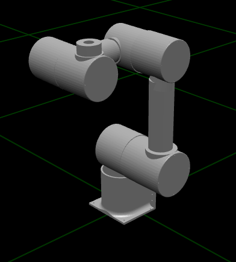

# Robotic Arm Simulation

!


This project represents a robotic arm model designed for simulation in Gazebo. The robotic arm is described using URDF (Unified Robot Description Format) and includes visual and collision elements.

## Project Structure

- **URDF Files:**
  - `rover_arm.urdf.xacro`: The main URDF file describing the robotic arm structure.
  - Other files like `Joint1.stl`, `Connector1.stl`, etc., contain mesh definitions used in the visualization.

- **Launch Files:**
  - `rover_arm_gazebo.launch`: Launch file to spawn the robotic arm model in Gazebo.
  - `rover_arm_rviz.launch`: Launch file to visualize the robotic arm model in RViz.

## Dependencies

Before using this robotic arm simulation, make sure you have the following dependencies installed:

- [ROS (Robot Operating System)](http://www.ros.org/)
- [Gazebo](http://gazebosim.org/)
- [Xacro](http://wiki.ros.org/xacro)

## Usage

1. **Clone the Repository:**
   ```bash
   git clone <repository-url>
   cd <repository-directory>

2. **Build the Workspace:**
   ```bash
   catkin build

3. **Source the Workspace:**
   ```bash
   source devel/setup.bash

4. **Launch the Simulation in Gazebo:**
   ```bash
  roslaunch rover_arm_gazebo.launch

This will spawn the robotic arm in a Gazebo simulation environment.

5. **Launch RViz for Visualization:**
   ```bash
   roslaunch rover_arm_rviz.launch

This will visualize the robotic arm model in RViz.
